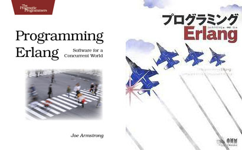
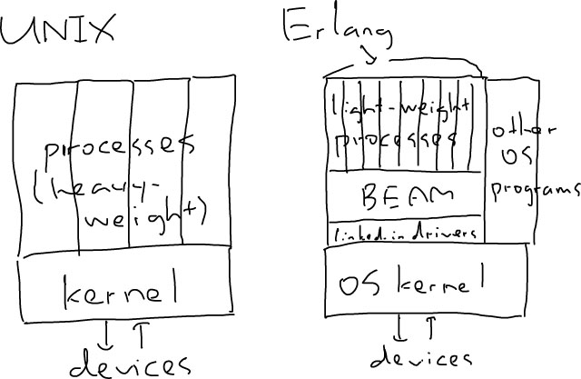
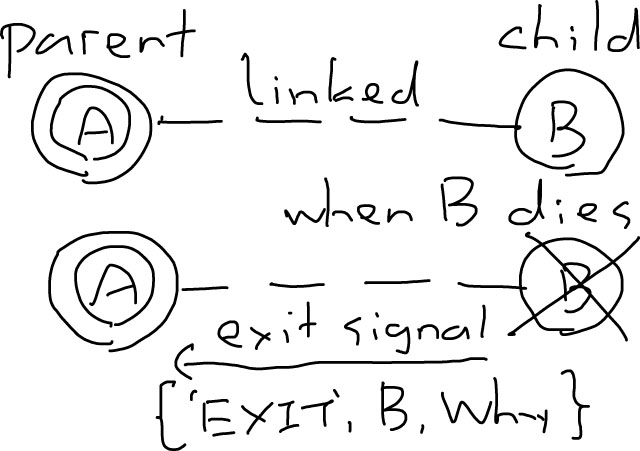
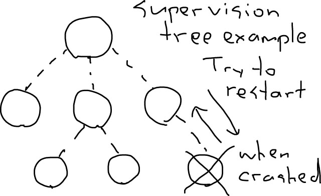
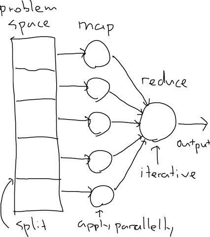
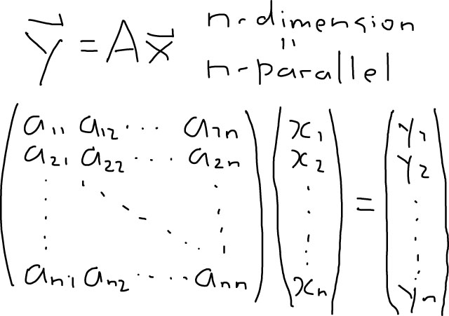
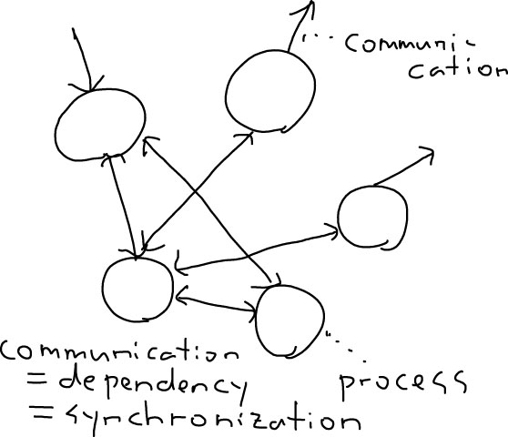
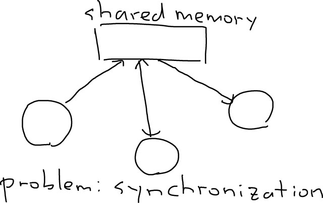
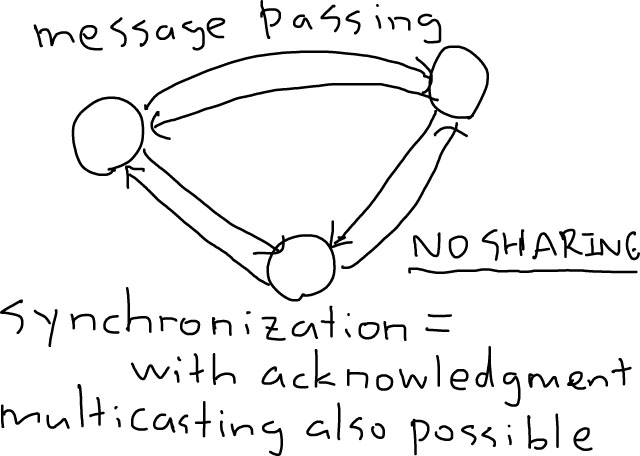
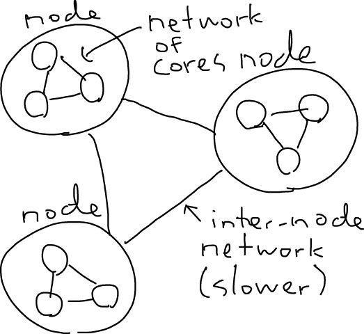

# Erlang/OTP並行処理システムと情報セキュリティの未来 2012年10月29日 力武 健次

---

## 自己紹介と人生歴

* 1974年（9才）からコンピュータ触ってます
* 1986年からネットにはまってます
* システム管理とプログラミングが仕事です
* 最近は情報セキュリティの社会的，政治的，人的問題への対応で苦労してます
* 関数型言語の専門家ではありません

---

## プログラミング言語歴(1)

* 1970年代にFORTRANを触りました
* 1980年代にC言語を覚えました
* 1989年にPrologの単位を落としました
* 2008年ぐらいまで関数型言語には劣等感がありました（今でもあります）

---

## プログラミング言語歴(2)

* 1980年代前半にLISPの本を初めて読みました，が，当時はS式はわかりませんでした
* 1980年代後半にUtiLispの発祥の地（和田英一先生の研究室）に在籍していましたが，劣等生でした（ネットで遊んでばかりいました）
* C++やJavaはよくわかっていません
* Erlangは初めて真剣に向き合った関数型言語です

---

## 1980年代の関数型言語の印象

* 遅い，重い（インタプリタ）
* メモリを食いすぎる
* 速く書けない（手抜きができない）
* CPUは今より約2000倍遅かった
* VAX8600 (1984): 4.1 VAX MIPS, 256MB
* i5-2410M (2011): ~8600 VAX MIPS, 4GB

---

## サボったツケを払っています

* 1980年代にLISPやGHC（ホーン節の方），Mirandaの本を買った覚えがありますが，理解できず手放しました
* 1989年に単位を落として以来Prologは好きではありません
* …しかし約20年後の2008年になって，Prologに似たパターンマッチ文法（意味は違いますが）のErlangを勉強する羽目になりました
* 20年分の勉強をやり直しています

---

## （私見）この20年間未解決の課題

* 分散システムの基礎理論
* TCP/IP （未だにIPv4中心）
* 逐次プログラミングからの脱却
* 信頼性の高いシステム構築
* 情報セキュリティとプログラミングの関係
* 電子メールからの脱却

---

## 20年間興味の持てなかったこと

* (C++, Java的)オブジェクト指向
* 厳格な階層的クラス構造
* 細かいWebページの作り方
* Windowsでのコーディング
* 「Web広告ビジネス」

---

## ではなぜErlangを?

* 2007年にDNSサーバBINDの一部改造の結果に関する論文を書いていたが，あまりにもソースの行数が多くて泣きそうだった
* 何か他の言語をやらないと時代に取り残される気がした
* 2008年春にたまたま東京出張の時にErlangの本を立ち読みした
* それ以来ハマっている

---

## 私のハマった本

* Joe Armstrong "Programming Erlang"
* 日本語版はオーム社「プログラミングErlang」

---

# Erlangの簡単な歴史

---

## Erlang開発の背景

* Ericsson Computer Science Lab (CSLab)
* 1985年から電話交換機用として開発が始まる
* 専用→汎用ハードウェアへの移行
* 過去からの知見: ポインタの利用を避ける
* 呼とプロセスの対応: ユーザランドでの管理

---

## Erlangを書いた主な人達

* Bjarne D&auml;cker: CSLabのリーダー
* Joe Armstrong: 基本言語仕様の設計と実装
* Mike Williams: Cによる仮想マシンの実装
* Robert Virding: ライブラリの実装
* Claes Wikstr&ouml;m: 分散環境の実装
* そして現在: Ericsson OTP Team

---

## Erlang（アーラン）の由来

* Agner Krarup Erlang (1878-1929)
* デンマークの数学者
* 電話交換の呼制御で待ち行列理論を確立
* …実際の発音は「エアラング」に近い
* 実は ERicsson LANGuage だからという話も

---

## 交換機システムの要件(1)

* 非常に大量の並行動作を制御する
* 一定時刻または一定時間以内での動作
* 複数計算機での分散動作
* ハードウェアとの確実なやり取り
* 超大規模ソフトウェアシステム

---

## 交換機システムの要件(2)

* 競合する特徴をまとめる複雑な機能性
* 数年間は無停止で動き続ける
* 無停止での設定変更やソフトウェア交換
* 非常に厳しい品質と信頼性に対する要求
* ハード/ソフト双方への耐故障性

---

## 交換機システムとWebシステム

* 要件が良く似ている
* HTTP(S)はTCP（コネクション）ベース
* HTTP(S): data plane
* DNSはUDP（コネクションレス）ベース
* DNS: control planeの一部

---

## Erlang開発の成果(1)

* 1995年に新製品への投入が決定
* 1998年にAXD301 GPRS交換機に実装
* 同年Ericsson内部でErlang使用禁止令
* 同年オープンソース化される
* 開発メンバーが独立 (Bluetail AB)

---

## Erlang開発の成果(2)

* Bluetail ABはNortelに買収されるが，2000年のITブーム終息後Nortelは人員削減を行い，メンバーの一部は再度独立
* Erlangを使ったベンチャー企業ができる (Kreditor, Klarna, Process-One, Trifork, etc.) 
* CSLabは2002年に閉鎖，保守はOTP Teamへ移行
* 運用支援や教育を行う Erlang Consulting (現 Erlang Solutions) も1999年に設立，サポートも充実

---

## Erlang開発の成果(3)

* 2006年にSMPマルチコア環境に対応
* 2009年11月: Erlang/OTP，オープンソース版開発をGitHubベースに移行
* 大規模耐障害性ストレージへの応用が始まる
* 2010年7月: Gemini Mobile (現Cloudian), Hibari 1.0リリース
* 2011年9月: Basho Technologies, Riak 1.0 リリース
* 現在多くの大規模Webサービスで使われている

---

## Erlangの定番アプリ

* サーバサイドが得意
* HTTP(S): MochiWeb, Yaws
* XMPP: ejabberd
* 負荷試験ツール: Tsung
* NoSQL: CouchDB, Riak
* Property test: QuickCheck

---

# Erlangの特徴

---

## Erlangの実装方式

* BEAM: 仮想マシン(VM)
* 粒度の細かいガベージコレクタ(GC)
* Cによる拡張ライブラリ (Native Interface Functions (NIFs))
* BEAM間通信による分散処理
* JVMの実装もある(Erjang)

---

## ErlangとユーザランドVM

---

## 基本はシンプルな関数型言語

    !erlang
    %%% 階乗の計算
    -module(factorial). % モジュール名
    -export([f/1]).     % 外部に見せる関数

    % factorial:f/1
    f(N) when is_integer(N), N > 0 -> f(N, 1).

    % factorial:f/2 内部用 末尾再帰の関数
    % 関数は1つ以上のパターンマッチから成る
    f(1, F) -> F;
    f(N, F) -> f(N - 1, N * F).

---

## Erlangの主な構成要素

    !erlang
    A = atom, Int = 123, Float = 1.0,
    Tuple = {A, 1.0, test}, % 有限個
    List = [A, Int, Float], % 可変長
    List =:= [A | [Int, Float] ]. % head/tail演算
    module:func(Arg1, Arg2). % 関数呼び出し
    fun module:func/2. % (2はarity)
    Fun = fun(X) -> X * 2. % (funは無名関数)
    A = <<10, 20, 30>>. % 3バイトのバイナリ
    <<X:12, Y:8, Z:4>> = A. % ビット操作も可能
    [X,Y,Z] =:= [161, 65, 14].
    %%% リスト内包表記: map関数と同義
    [2*P || P <- [X,Y,Z]] =:= [322,130,28].

---

## 変数と単一代入原則

* 変数は大文字または`_`（アンダースコア）で始まる
* 変数のスコープは関数内のみ
* 代入とはコピーを作ること
* 変数の代入は関数内で1回だけ
* `A = A + 1` は間違い
* `A2 = A + 1` として新しい変数に代入するのがErlangでの正しいやり方

---

## Erlangに存在しないもの

* ポインタ（GCでメモリ管理）
* Java的なオブジェクト指向
* Java的な階層的名前構造
* 型推論（Dialyzerで実現）
* ループ（すべて末尾再帰）
* Cの`static`変数

---

## 軽量プロセス=再起動が容易

* 従来: プロセスを落とさないプログラミング（例外処理，エラー捕捉）
* Erlang: 「落ちたら再起動」 (Let it fail原則)
* プロセス起動: `Pid = spawn(Function)`
* エラーシグナルの伝達: `link(Pid)`
* Linkによりプロセス終了原因の把握が可能

---

## Linkによる例外捕捉

---

## スーパーバイザツリー

---

## プロセス間メッセージ

    !erlang
    %%% Pid: プロセスID (BEAM内一意)
    %%% メッセージの送信
    Pid ! {self(), {request, Request}}.
    %%% メッセージの受信: receive文
    %%% 簡単なechoのループ
    loop() -> 
        receive
            {From, {request, R}} ->
                From ! R,
                loop();
            {From, Other} ->
                From ! {error, Other},
                loop()
        end.

---

## Erlangの分散環境機能

* TCP/UDP/SCTPソケットは直接使える
* BEAM間のRPC(TCPベース)が可能
* 他ノードでのプロセス生成が可能
* ノード間でのメッセージ送受信が可能
* ノード間の関係は対等

---

## ErlangとOTP

* Open Telecom Platform
* Erlang/OTPとして標準配布
* ライブラリとデザインパターンの集まり
* 分散データベース Mnesia
* SNMP, ASN.1, SSH, SSL, 一通りある
* Behaviour: サーバデザインのパターン集

---

## Erlangの実現したもの(1)

* 並行ユーザランドプロセス
* スレッドより軽い超軽量プロセス
* 「無共有」を前提としたプロセス定義
* 純粋非同期メッセージパッシング
* 言語の基本仕様は簡単な関数型言語 

---

## Erlangの実現したもの(2)

* データベース実装用の破壊的操作
* サービス中のコード更新
* 大規模なライブラリ(OTP)
* 並行プログラミングに適した機能
* （結果としての）並列処理対応

---

## Erlang/OTP関連のコミュニティ

* <http://www.erlang.org/>
* Erlang Factory (Lite)
* ACM SIGPLAN Erlang Workshop
* erlang-questions@erlang.org
* 各地のErllounge

---

## Erlang/OTPのこれからの課題

* 超大規模マルチコア環境への対応
* [EU RELEASE Project](http://www.release-project.eu)
* ロックを減らして高速化: 無停止プログラム更新などの現在の機能を満たしつつ実現するのは大変困難だが進んでいる
* UTF-8への対応（文字列，変数名，atom名，etc.）

---

# 並行と並列の問題

---

## 現在のプログラミング環境

* そこそこ速い（VMでも）
* メモリはそこそこたくさん使える
* 正確さ，保守性が重要視される
* 関数型「的」言語の普及
* ササッと書ける開発環境の普及

---

## 現在の高速化の課題

* 個々のCPUは速くはもうならない
* 逐次プログラミングではもう限界
* 性能向上=マルチコア化は必須
* しかし，メモリもI/Oも遅い
* それに，通信はもっと遅い
* →並列処理指向へ

---

## 並列と並行の違い(1)

* 並列: parallel
* 並列処理: 処理を複数の部分に分割し同時に処理して，統合した結果を得ること
* 並行: concurrent
* 並行処理: 複数の互いに影響し合う処理を，単独の仕組みの中で実行すること

---

## 並列と並行の違い(2)

* 並列処理: 事前に相互依存性を排除
* 問題分割: ループの並列化など
* 部分結果の統合は並列化が難しい
* 代表的パターン: FFT, MapReduce
* パターンを見付けるのが大変

---

## 並列の例(1): MapReduce

---

## 並列の例(2): 一次変換

---

## 並列と並行の違い(3)

* 並行処理: 一般的な現象
* OS，社会，宇宙，個人，電子回路
* 処理単位が相互に情報交換
* 情報交換には同期（待ち合わせ）が必要
* 並行処理は1個のCPUでもできる

---

## 並行処理の世界

---

## プロセス間情報交換の方法(1)

* 従来のやり方: 共有メモリ
* ホワイトボードを皆で見るのと似ている
* 書き込み/読み出しの同期の問題が発生
* 同期制御には別の仕組み（ロック）が必要
* ロックは並列性を大きく損なう

---

## 共有メモリの問題

---

## プロセス間情報交換の方法(2)

* 最近流行のやり方: メッセージパッシング
* 「共有」せず個別に通信を行う
* 同期は通信手順に含めることができる
* 非同期（投げっぱなし）も可能
* ロックする期間を短くできる

---

## メッセージパッシング

---

## メッセージパッシングの課題

* 通信コスト（スループットと遅延）
* 通信の局所性が性能に効いてくる
* SMP（全CPUを平等に扱う）では不十分
* SMPは*O(n^2)*なので超多コア環境には不向き
* Erlang固有の分散処理はSMPが前提

---

## 通信の局所性と遅延

---

## Erlangと状態保持/共有

* 共有メモリを可能な限り排除
* 共有はプロセスの中だけ（プロセス辞書）
* ループの状態は末尾再帰の引数で引き継ぐ
* プロセス間で共有する状態テーブルはライブラリで実装: ets, dets（ディスク使用）
* さらに高度化したのがMnesia

---

## 並行と並列は別の概念

* 並行は実用システムの前提
* 並列は実装上の問題
* 並行処理をどう並列化するか
* Erlangは並行処理に注力
* 並列化で意味が変わらないシステムが必要

---

# 情報セキュリティとErlang

---

## 技術を論じる前に

* 情報セキュリティは大部分が人間の問題
* どんな技術も人間のミスで無意味になる
* しかしだからといって技術は無視できない
* 技術的努力で脆弱性を防げる(はず)
* 技術的努力で事故の拡大を防げる(はず)

---

## プログラミングとセキュリティ

* 信頼性は情報セキュリティの前提
* しかし間違いをゼロにはできない
* コード自身の予定外動作
* 外部入力に対する誤動作
* 複数プロセスの相互干渉
* なら問題の影響範囲を限定できないか?

---

## パッチ当てで解決できない問題

* パッチ当ては既知の脆弱性対策には有効
* 見つからなければ放っておけるのか?
* しかし現実にはゼロデイアタックが頻発
* 後から直したのでは追いつかない
* 潰しても潰してもなくならない問題

---

## 本質的なプログラミングの問題

* 共有メモリ / メモリ管理
* 形式的整合性チェック（型，範囲）
* 予期しない共有=相互依存の防止
* 完全にテストを行うことの難しさ

---

## Erlangの制約とセキュリティ

* 一度使った記憶領域はいじらせない（データベースなど実装上の制約がある場合のみを例外とする）
* 関数型プログラミングの手法による副作用の最小化，コードの定式化，モジュール化
* 処理を小さなプロセスに分割し，異常動作時の停止と再起動を容易にする
* 外部ツールで型解析，unit testing, property testingを可能とする

---

## Erlangのテストツール

* common\_test: OTP標準
* Dialyzer: 動的型付けによる解析
* EUnit: 簡便なunit testing
* QuickCheck: property testing用，元々はHaskellで開発（QuviQが商用で販売）
* [PropEr](http://proper.softlab.ntua.gr/): オープンソースのproperty test

---

## Erlangとリファクタリング

* リファクタリング=冗長なコードの削減によって信頼性の向上ができる
* [RefactorErl](http://pnyf.inf.elte.hu/trac/refactorerl/wiki)
* [Wrangler](http://www.cs.kent.ac.uk/projects/wrangler/Home.html)
* [Tidier](http://tidier.softlab.ntua.gr/mediawiki/index.php/Main_Page)

---

## Erlangのセキュリティ面での課題

* BEAM間通信のアクセス制御と暗号化
* 大規模なクライアント側プログラムへの応用（Webブラウザなど）（前例やライブラリがないわけではないが事例が少ない）
* マルチコア化に伴うコア単位のアクセス制御（現状でもaffinityなどの制御は可能）
* OTP各ライブラリの相互依存関係の明確化
* NIFに頼らない高速化

---

## 並行処理と暗号化

* 並行処理できる暗号技術の開発
* 過去の状態に依存する=逐次処理が必要
* 過去の状態に依存しない関数を使う
* カウンタベース疑似乱数 (ACM SC'11)
* カウンタモード(CTR)での暗号化
* 安全性の検証が必要

---

# まとめ: 結局Erlangでどんな未来?

---

## Erlangの並行的思考法

* 共有メモリの徹底排除
* 軽量プロセス=軽量GC
* Location transparency
* メッセージパッシング
* Let it fail/crash 原則

---

## 並行的思考法とセキュリティ

* 信頼性から見たセキュリティ対策
* 部分がコケても全体は止まらない
* 危ないコーディングをさせない
* 結果としてのセキュリティ向上
* イバラの道だがこちらが本筋では?

---

## おわりに: 日本での並行プログラミング

* 第5世代コンピュータプロジェクト
* 並行論理プログラミング
* Guarded Horn Clauses (GHC), KL1
* 上田和紀，近山隆 （和田研OB）
* Erlangも同じ流れから派生している
* Erlangは論理型言語ではない

---

## 参考文献

* [上田和紀「並行論理プログラミング言語GHC/KL1」(2000年)(PDF)](http://www.ueda.info.waseda.ac.jp/~ueda/readings/GHC-intro.pdf)
* [Joe Armstrong "A History of Erlang"](http://dl.acm.org/citation.cfm?doid=1238844.1238850) (ACM HOPL III (2007), DOI: 10.1145/1238844.1238550)
* [Kenneth Lundin, Rickard Green, Patrik Nyblom "Taking a Virtual Machine Towards Many-Core"](http://www.erlang-factory.com/upload/presentations/662/StAndrews_complete.pdf) (St Andrews Erlang Factory Lite 2012)
* 本橋信也，河野達也，鶴見利章「NOSQLの基礎知識」リックテレコム ISBN978-4-89797-887-1

---

# Questions?

